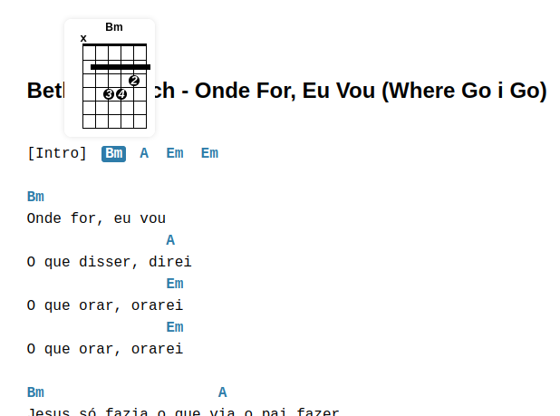

# Acordes Cifra

Exemplo de acordes gerados por javascript em canvas.




Criando um acorde de Dó (C) conforme este exemplo .

```javascript
// Instância a biblioteca de acordes
let biblioteca = new BibliotecaAcorde();

// Busca o acorde de Dó (C) da biblioteca
let acorde = biblioteca.getAcordePorCifra("C");

// Instância um novo acorde
let novoAcorde = new Acorde(acorde.n, acorde.m, acorde.d,acorde.p);

/**
 * Retrona um canvas para ser inserido no nó e um elemento por append(),
 * ex: campoAcorde.appendChild(novoAcorde.montaAcorde());
 */
novoAcorde.montaAcorde();
```

Sendo que a biblioteca é gerada por esta notação de texto **"X 3 2 0 1 0"** comum em cifras.

#### Atualmente contempla a criação:

* Grelha simples de acorde
* Grelha avançada de acorde
* Digitação
* Número do dedo para digitação
* Pestanas simples
* Biblioteca de acordes básicos
* Leitura de cifra para apresentar acorde
* Transposição de acorde

## TODO

* Grelha com capotraste