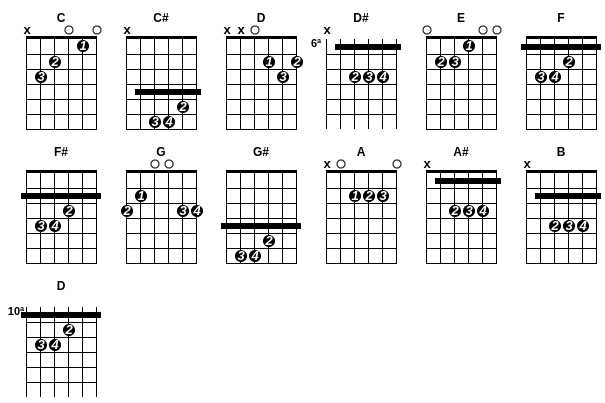

# Acordes Cifra

Exemplo de acordes gerados por javascript em canvas.



Criando um acorde de Dó (C) conforme este exemplo .

```javascript
this.montaAcorde('C', 'X 3 2 0 1 0', '032010');
```

Sendo esta notação de texto **"X 3 2 0 1 0"** comum em cifras.

#### Atualmente contempla a criação:

* Grelha simples de acorde
* Digitação
* Número do dedo para digitação
* Pestanas simples